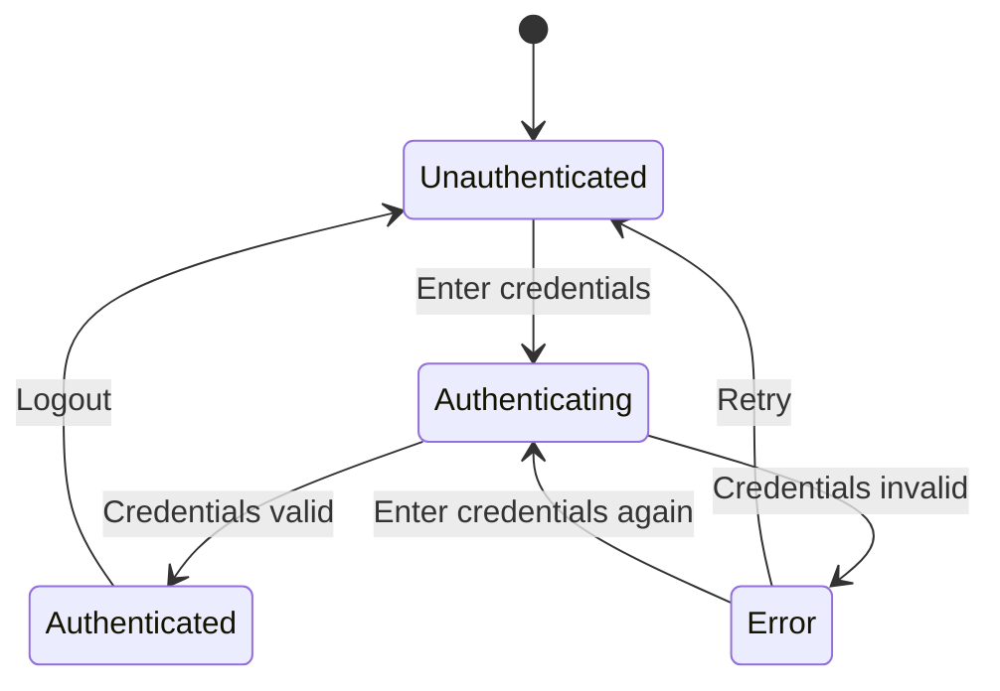
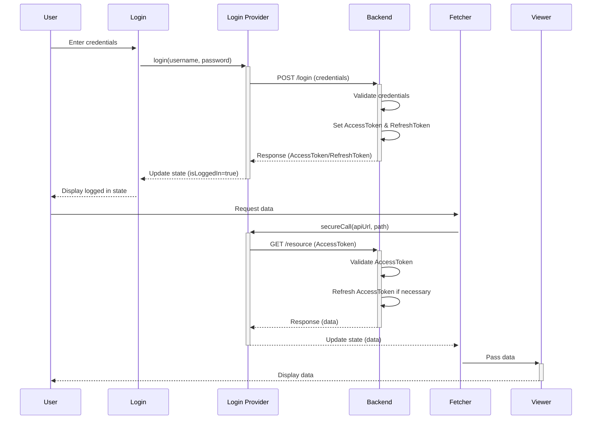

# Login-provider

## Översikt

**LoginProvider** är ett front-end-projekt byggt med React och Vite för att hantera användarautentisering och UI-komponenter. Applikationen använder Storybook för att skapa och testa UI-komponenter i en isolerad miljö. Det finns stöd för olika inloggningsmetoder, inklusive JWT och lokal autentisering.

## Funktioner

- React och Vite som utvecklingsmiljö
- Storybook för UI-komponenttestning
- Olika inloggningsmetoder: JWT, lokal inloggning och mockade inloggningar
- Komponentbaserad arkitektur för återanvändbara UI-element som **LoginPage**, **UserAtom**, och **PasswordAtom**

## Krav

- Node.js (v18 eller senare)
- npm eller yarn

## Installation

1. Klona repot:
    ```bash
    git clone https://github.com/Ibrah111m/LoginProvider.git
    cd LoginProvider
    ```

2. Installera nödvändiga beroenden:
    ```bash
    npm install
    ```

## Skript

- Starta utvecklingsservern:
    ```bash
    npm run dev
    ```

- Bygg projektet:
    ```bash
    npm run build
    ```

- Starta Storybook för att testa UI-komponenter:
    ```bash
    npm run storybook
    ```

- Bygg Storybook:
    ```bash
    npm run build-storybook
    ```

- Lint din kod:
    ```bash
    npm run lint
    ```


## Login Context



## Login Process



# LoginProvider

## App Flow Diagram


## Komponenter i Storybook

### Följande komponenter kan testas i Storybook:

- **LoginPage.stories.jsx** – Testar `LoginPage`-komponenten
- **UserAtom.stories.jsx** – Testar `UserAtom`-komponenten
- **PasswordAtom.stories.jsx** – Testar `PasswordAtom`-komponenten
- **LoginOrganism.stories.jsx** – Testar en organism med flera inloggningskomponenter
- **ProfileOrganism.stories.jsx** – Testar profilkomponenten

## Licens

Detta projekt är licensierat under MIT-licensen.
